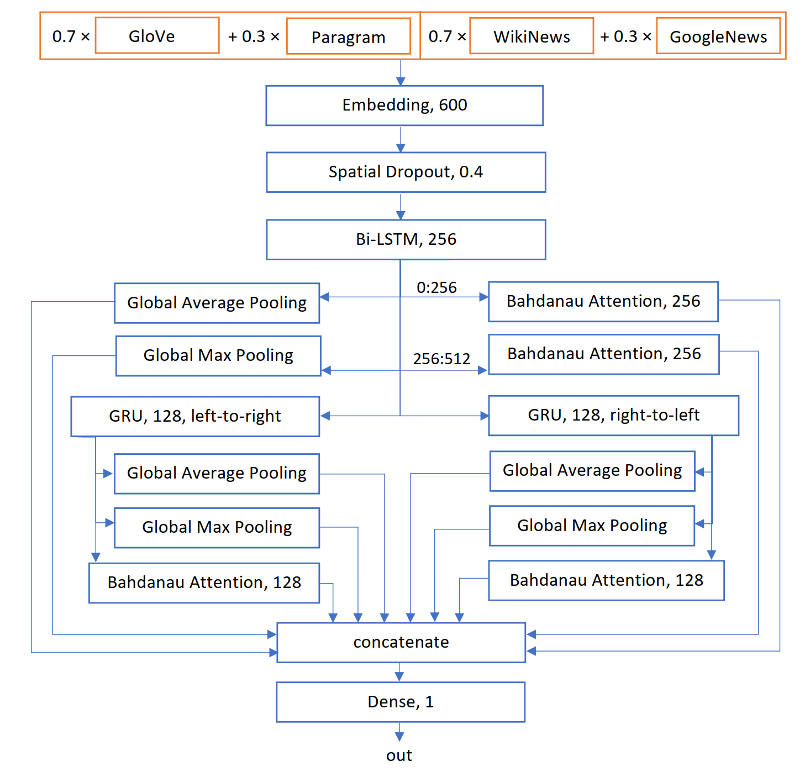

# Insincere Questions Classifier
Deep learning model for the Quora Insincere Questions Classification competition on Kaggle. Based on bidirectional LSTMs, GRUs and Bahdanau attention.

| Public F1 Score  | Private F1 Score |
| :--------------: |:----------------:| 
| 0.69536          | 0.70140          |

## Model
The model is in essence a logistic regression classifier whose inputs are featrures extracted in previous layers: 
 

 
The input to the model are two 300 dimensional weighted sums of pretrained embeddings available on the competition, concatenated to a single 600 dimensional input vector passed to the embedding layer. Embeddings were frozen during training.  
After spatial dropout, a bidirectional LSTM layer is applied, whose states are averaged and max pooled. Besides that, the last output state is passed to the Bahdanau attention layer as a query, together with all outputs over time as values. This was done separately for the first 256 dimensions of the output states, which are result of the left-to-right LSTM pass. The same thing was repeated for the second 256 dimensions of the LSTM states (right-to-left pass).  
The second middle layer is a bidirectional GRU, but implemented as two separate layers - one in the LTR, and other in RTL direction. This may look as a weird choice, but couple of experiments constantly showed better performance when implemented this way. The GRU states from both directions were averaged and max pooled, as well as passed to the respective Bahdanau attention layer as values, together with last output states as queries.  
All average, max pool and attention outputs are concatenated and passed to the single neuron in the output dense layer. Vectors from LSTM layer are passed through a skip connection over the GRU layers. This is effectively a logistic regression classifier whose input is a vector of extracted features from different network layers. 

## Applied Techniques

## Prerequisites

## Usage

